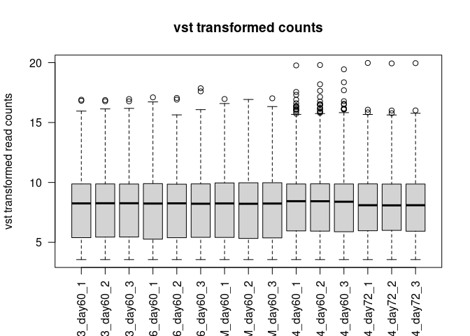
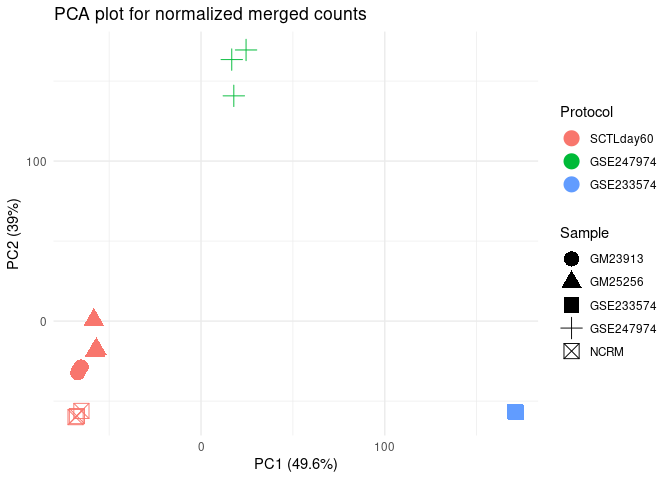

We integrated SCTL samples at day60 in our 2 month-old hCBO data with the following two datasets and identified DEGs among cerebellar markers across protocols. 

For the quadrato lab, we focused on three samples below (they generated three replicates at day 60):  
[GSE247974](https://www.ncbi.nlm.nih.gov/geo/query/acc.cgi?acc=GSE247974)
GSM7904010: organoid D1, scRNA-seq  
GSM7904011: organoid D2, scRNA-seq  
GSM7904012: organoid D3, scRNA-seq  

For the pasca lab, we only focused on one sample (at day 72) below:  
[GSE233574](https://www.ncbi.nlm.nih.gov/geo/query/acc.cgi?acc=GSE233574)
GSM7430706: OrganoidScreen; sample11; FGF2-50  

There is only one sample (GSM7430706) in GSE233574. We did sub-sampling in cells of GSM7430706 and calculated psudo-bulk of sub-samples for comparisons. 


``` r
# knitr::opts_chunk$set(tidy=FALSE, cache=FALSE, echo=TRUE, dev="png", message=FALSE, error=FALSE, warning=FALSE)
knitr::opts_chunk$set(echo=TRUE, warning=F, message=F)

library("tidyr")
library("dplyr")
library("ggplot2")
library("knitr")
library("pheatmap")
library("DT")

library("Seurat")
library("DESeq2")

rm(list=ls())

d_geo  = "/data/qiangchen/Projects/NCATS/SCTL/SeungMiRyu/hCBO/GEO/"
d_sctl = "/data/qiangchen/Projects/NCATS/SCTL/SeungMiRyu/hCBO/ISB038/htseq_count/"

d_proj = "/data/qiangchen/Projects/NCATS/SCTL/SeungMiRyu/hCBO/SCTLday60_GSE247974_GSE233574/"
d_dat  = paste0(d_proj, "Data/")
d_res  = paste0(d_proj, "Results/")
```

# Load SCTL data


``` r
f_count = paste0(d_dat, "count_matrix.SCTLday60_GSE247974_GSE233574.qced.rda")
load(f_count)
```

# Normalize merged counts


``` r
dds = DESeqDataSetFromMatrix(
    countData = count_matrix,
    colData = sampleInfo,
    design = ~ 1
)

norm_matrix = vst(dds, blind = T)
norm_matrix = assay(norm_matrix)
```

# Boxplot of normalized counts.


``` r

boxplot(norm_matrix,main="vst transformed counts", ylab = "vst transformed read counts", las=2)
```

<!-- -->

# PCA for normalized counts


``` r
pca_result = prcomp(t(norm_matrix)) 

pca_scores = as.data.frame(pca_result$x)
pca_scores = cbind(ID=rownames(pca_scores), pca_scores)
pca_scores = merge(pca_scores, sampleInfo, by="ID")

p = ggplot(pca_scores, aes(x=PC1, y=PC2, color=Protocol, shape=Sample)) +
    geom_point(size = 5) +
    theme_minimal() +
    labs(title = "PCA plot for normalized merged counts",
       x = paste0("PC1 (", round(summary(pca_result)$importance[2, 1] * 100, 1), "%)"),
       y = paste0("PC2 (", round(summary(pca_result)$importance[2, 2] * 100, 1), "%)")) 

print(p)
```

<!-- -->

``` r
f_fig = paste0(d_res, "PCA_plot.SCTLday60_GSE247974_GSE233574.normalized.pdf")
ggsave(f_fig, p)
```

# Session Information


``` r

sessionInfo()
## R version 4.4.3 (2025-02-28)
## Platform: x86_64-pc-linux-gnu
## Running under: Rocky Linux 8.7 (Green Obsidian)
## 
## Matrix products: default
## BLAS/LAPACK: /usr/local/intel/2022.1.2.146/mkl/2022.0.2/lib/intel64/libmkl_rt.so.2;  LAPACK version 3.9.0
## 
## locale:
##  [1] LC_CTYPE=en_US.UTF-8       LC_NUMERIC=C              
##  [3] LC_TIME=en_US.UTF-8        LC_COLLATE=en_US.UTF-8    
##  [5] LC_MONETARY=en_US.UTF-8    LC_MESSAGES=en_US.UTF-8   
##  [7] LC_PAPER=en_US.UTF-8       LC_NAME=C                 
##  [9] LC_ADDRESS=C               LC_TELEPHONE=C            
## [11] LC_MEASUREMENT=en_US.UTF-8 LC_IDENTIFICATION=C       
## 
## time zone: America/New_York
## tzcode source: system (glibc)
## 
## attached base packages:
## [1] stats4    stats     graphics  grDevices utils     datasets  methods  
## [8] base     
## 
## other attached packages:
##  [1] DESeq2_1.46.0               SummarizedExperiment_1.36.0
##  [3] Biobase_2.66.0              MatrixGenerics_1.18.1      
##  [5] matrixStats_1.5.0           GenomicRanges_1.58.0       
##  [7] GenomeInfoDb_1.42.3         IRanges_2.40.1             
##  [9] S4Vectors_0.44.0            BiocGenerics_0.52.0        
## [11] Seurat_5.2.1                SeuratObject_5.0.2         
## [13] sp_2.2-0                    DT_0.33                    
## [15] pheatmap_1.0.12             knitr_1.50                 
## [17] ggplot2_3.5.1               dplyr_1.1.4                
## [19] tidyr_1.3.1                
## 
## loaded via a namespace (and not attached):
##   [1] RColorBrewer_1.1-3      rstudioapi_0.17.1       jsonlite_2.0.0         
##   [4] magrittr_2.0.3          spatstat.utils_3.1-3    farver_2.1.2           
##   [7] rmarkdown_2.29          ragg_1.3.3              zlibbioc_1.52.0        
##  [10] vctrs_0.6.5             ROCR_1.0-11             spatstat.explore_3.4-2 
##  [13] S4Arrays_1.6.0          htmltools_0.5.8.1       SparseArray_1.6.2      
##  [16] sass_0.4.9              sctransform_0.4.1       parallelly_1.43.0      
##  [19] KernSmooth_2.23-26      bslib_0.9.0             htmlwidgets_1.6.4      
##  [22] ica_1.0-3               plyr_1.8.9              plotly_4.10.4          
##  [25] zoo_1.8-13              cachem_1.1.0            igraph_2.1.4           
##  [28] mime_0.13               lifecycle_1.0.4         pkgconfig_2.0.3        
##  [31] Matrix_1.7-2            R6_2.6.1                fastmap_1.2.0          
##  [34] GenomeInfoDbData_1.2.13 fitdistrplus_1.2-2      future_1.34.0          
##  [37] shiny_1.10.0            digest_0.6.37           colorspace_2.1-1       
##  [40] patchwork_1.3.0         tensor_1.5              RSpectra_0.16-2        
##  [43] irlba_2.3.5.1           textshaping_1.0.0       labeling_0.4.3         
##  [46] progressr_0.15.1        spatstat.sparse_3.1-0   httr_1.4.7             
##  [49] polyclip_1.10-7         abind_1.4-8             compiler_4.4.3         
##  [52] withr_3.0.2             BiocParallel_1.40.1     fastDummies_1.7.5      
##  [55] MASS_7.3-65             DelayedArray_0.32.0     tools_4.4.3            
##  [58] lmtest_0.9-40           httpuv_1.6.15           future.apply_1.11.3    
##  [61] goftest_1.2-3           glue_1.8.0              nlme_3.1-167           
##  [64] promises_1.3.2          grid_4.4.3              Rtsne_0.17             
##  [67] cluster_2.1.8           reshape2_1.4.4          generics_0.1.3         
##  [70] gtable_0.3.6            spatstat.data_3.1-6     data.table_1.17.0      
##  [73] XVector_0.46.0          spatstat.geom_3.3-6     RcppAnnoy_0.0.22       
##  [76] ggrepel_0.9.6           RANN_2.6.2              pillar_1.10.1          
##  [79] stringr_1.5.1           spam_2.11-1             RcppHNSW_0.6.0         
##  [82] later_1.4.1             splines_4.4.3           lattice_0.22-6         
##  [85] survival_3.8-3          deldir_2.0-4            tidyselect_1.2.1       
##  [88] locfit_1.5-9.12         miniUI_0.1.1.1          pbapply_1.7-2          
##  [91] gridExtra_2.3           scattermore_1.2         xfun_0.52              
##  [94] stringi_1.8.7           UCSC.utils_1.2.0        lazyeval_0.2.2         
##  [97] yaml_2.3.10             evaluate_1.0.3          codetools_0.2-20       
## [100] tibble_3.2.1            cli_3.6.4               uwot_0.2.3             
## [103] systemfonts_1.2.1       xtable_1.8-4            reticulate_1.40.0      
## [106] munsell_0.5.1           jquerylib_0.1.4         Rcpp_1.0.14            
## [109] globals_0.16.3          spatstat.random_3.3-3   png_0.1-8              
## [112] spatstat.univar_3.1-2   parallel_4.4.3          dotCall64_1.2          
## [115] listenv_0.9.1           viridisLite_0.4.2       scales_1.3.0           
## [118] ggridges_0.5.6          crayon_1.5.3            purrr_1.0.4            
## [121] rlang_1.1.5             cowplot_1.1.3

rm(list=ls())

```

