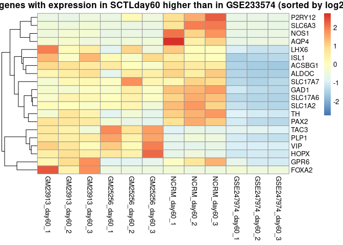
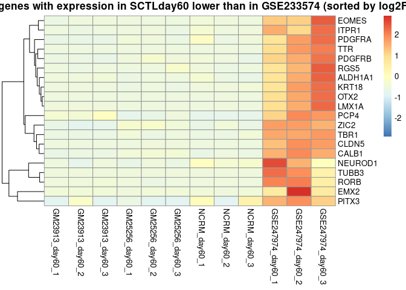
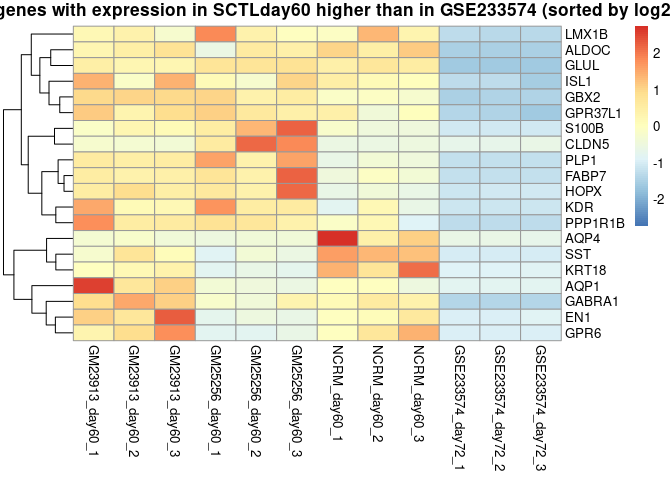
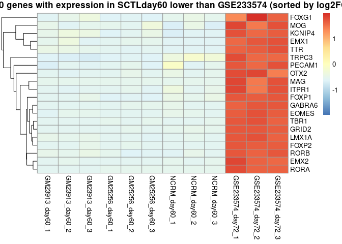

We integrated SCTL samples at day60 in our 2 month-old hCBO data with the following two datasets and identified DEGs among cerebellar markers across protocols. 

For the quadrato lab, we focused on three samples below (they generated three replicates at day 60):  
[GSE247974](https://www.ncbi.nlm.nih.gov/geo/query/acc.cgi?acc=GSE247974)
GSM7904010: organoid D1, scRNA-seq  
GSM7904011: organoid D2, scRNA-seq  
GSM7904012: organoid D3, scRNA-seq  

For the pasca lab, we only focused on one sample (at day 72) below:  
[GSE233574](https://www.ncbi.nlm.nih.gov/geo/query/acc.cgi?acc=GSE233574)
GSM7430706: OrganoidScreen; sample11; FGF2-50  

There is only one sample (GSM7430706) in GSE233574. We did sub-sampling in cells of GSM7430706 and calculated psudo-bulk of sub-samples for comparisons. 


``` r
# knitr::opts_chunk$set(tidy=FALSE, cache=FALSE, echo=TRUE, dev="png", message=FALSE, error=FALSE, warning=FALSE)
knitr::opts_chunk$set(echo=TRUE, warning=F, message=F)

library("tidyr")
library("dplyr")
library("ggplot2")
library("knitr")
library("pheatmap")
library("DT")

library("Seurat")
library("DESeq2")

rm(list=ls())

d_meta = "/data/qiangchen/Projects/NCATS/SCTL/SeungMiRyu/hCBO/Data/"
d_proj = "/data/qiangchen/Projects/NCATS/SCTL/SeungMiRyu/hCBO/SCTLday60_GSE247974_GSE233574/"
d_dat  = paste0(d_proj, "Data/")
d_res  = paste0(d_proj, "Results/")
```

# Load merged data


``` r
f_count = paste0(d_dat, "count_matrix.SCTLday60_GSE247974_GSE233574.qced.rda")
load(f_count)

sctl_samples = sampleInfo[sampleInfo$Protocol=="SCTLday60", "ID"]

f_cb = paste0(d_meta, "Full_Brain_Region_Marker_Table_Ryu_et_al.csv")
gene_data = read.csv(f_cb)
selected_genes = unique(gene_data$MarkerGene)
print(length(selected_genes))

matched = selected_genes %in% rownames(count_matrix)
selected_genes = selected_genes[matched]
print(length(selected_genes))
```

# DEG

We compared protocols using 110 cerebellar markers. Among them, 106 genes were found in the merged data. 


``` r

rownames(sampleInfo) = sampleInfo$ID

dds = DESeqDataSetFromMatrix(
    countData = count_matrix,
    colData = sampleInfo,
    design = ~ Protocol
)

dds = DESeq(dds, quiet=T)

f_dds = paste0(d_dat, "deg_model.SCTLday60_GSE247974_GSE233574.rds")
saveRDS(dds, f_dds)

norm_counts = counts(dds, normalized = TRUE)
rownames(norm_counts) = rownames(count_matrix)

norm_counts = norm_counts[selected_genes, ]
print(dim(norm_counts))
## [1] 108  15

f_norm = paste0(d_dat, "norm_counts.SCTLday60_GSE247974_GSE233574.CerebellarGenes.rds")
saveRDS(norm_counts, f_norm)

```

# DEG: SCTLday60 vs GSE247974


``` r

deg = results(dds, contrast=c("Protocol", "SCTLday60", "GSE247974"))

deg = as.data.frame(deg)
deg = cbind(Gene = rownames(deg), deg)

colnames(deg) = c("Gene", "baseMean", "log2FC", "lfcSE", "stat", "pval", "padj")
deg = deg[order(deg$padj),]

f_deg = paste0(d_res, "deg.SCTLday60_vs_GSE247974.tsv")
write.table(deg, f_deg, sep="\t", row.names=F, quote=F)

deg.cb = deg[selected_genes, ]
deg.cb = deg.cb[order(deg.cb$padj), ]

f_deg = paste0(d_res, "deg.SCTLday60_vs_GSE247974.cerebellar_genes.tsv")
write.table(deg.cb, f_deg, sep="\t", row.names=F, quote=F)

datatable(
    deg.cb,
    caption = "SCTLday60 vs GSE247974",
    rownames = FALSE,
    options = list(
        dom = 'Bfrtip', # B for buttons, frtip for other table features
        buttons = c('csv', 'excel'), # Add CSV and Excel download buttons
        pageLength = 10
    )    
) %>% 
    formatRound(columns = c("baseMean", "log2FC", "lfcSE", "stat", "pval", "padj"), digits = 2)
```


```{=html}
<div class="datatables html-widget html-fill-item" id="htmlwidget-ad04e60595f714c74881" style="width:100%;height:auto;"></div>
<script type="application/json" data-for="htmlwidget-ad04e60595f714c74881">{"x":{"filter":"none","vertical":false,"caption":"<caption>SCTLday60 vs GSE247974<\/caption>","data":[["TUBB3","TTR","OTX2","ACSBG1","RORB","SLC17A6","ALDOC","EOMES","ITPR1","EMX2","RGS5","CALB1","LMX1A","SLC17A7","SLC1A2","PDGFRB","CUX1","VIP","CLDN5","GAD1","HOPX","PAX6","TBR1","PLP1","KRT18","ALDH1A1","NR4A2","PDGFRA","ZIC2","PAX2","GLUL","PCP4","NEUROD1","ISL1","TH","FOXP1","SLC1A3","LHX5","GBX2","TLE4","ACTA2","PLCB4","DRD2","AQP4","CALB2","P2RY12","PROX1","LMX1B","S100B","TAC3","GRID2","KCNC1","LHX6","FOXP4","GPR37L1","CNTN2","BCL11B","OLIG2","GABRA1","NOS1","GRM1","SLC6A3","MEIS2","SOX10","KCNIP4","GPR6","MBP","CA8","SLC18A2","DDC","PITX3","ZIC1","KDR","RORA","RELN","PECAM1","ETV1","POU3F2","PVALB","DRD1","KCNJ6","SATB2","SST","ALDH1L1","TMEM119","FOXA2","EN2","FABP7","SOX9","CX3CR1","EN1","TMEM266","PCP2","FOXG1","EMX1","CUX2","SKOR2","NEUROD2","MAG","PPP1R1B","MOG","TRPC3","GABRA6","FOXP2","GRM2","GAD2","AQP1","SOX6"],[4672.699263390358,55428.20780412087,461.4736452654878,209.8793284060272,252.057935145044,2579.544436503768,1516.845277222522,28.01801531896578,389.4850984268111,200.6971919321612,455.1917217777096,654.8805475897848,327.450319916351,86.92877651080066,3510.706474580119,500.8955910226798,2460.405377032944,113.3199747527625,1685.361256269789,3498.113307119005,3571.142590193473,1199.119391028573,24.12014088210162,3751.059536801988,894.2470983067266,86.95022687260243,220.9649007596922,234.0153737012273,2240.685587124472,1054.622803265484,3964.825813749126,2583.879355495692,349.699335288566,13.80949192535209,146.1530034470545,1242.546250301686,6672.186929855413,293.601054539241,209.2863619284832,1992.379554929293,278.0644345689961,2031.306283489135,165.6749313689656,542.4060574280459,368.9740837726109,31.4457181325598,552.6935588320024,1060.12486264048,1448.481252435566,60.8289691642245,4235.033438209482,626.5934610233596,7.797042492459366,184.495472299788,24.35158168788846,1322.427289324945,428.4097248960279,18.45142334021111,70.06001539287695,393.3673169850452,524.6149907521703,8.456560260508972,2589.595661936627,7.285127795867756,1932.507944010858,5.070105929031548,169.5053098510677,1151.56629666115,14.16778309714081,15.72324114072201,1.543353934724912,3333.777613664669,188.4649967341364,5506.190992010997,1786.524828427754,15.6588561009689,548.2494554592544,1384.829657012181,8.753207050861242,41.28791199888341,788.2865508069374,136.7373230016853,3276.580620032894,63.06704287471826,2.828899762698156,3.093551339255415,137.1156489859042,10028.83826372096,1537.145816408735,5.334071196389329,35.53954276196558,128.3029492227415,1.609968516909825,14.29227473231807,7.015200375407876,1302.491886242337,314.4571002134601,637.0612766195802,5.828098892765108,191.4666540465695,7.223137414141824,275.1207835907632,8.722461985187289,2642.242142735481,50.90513404414387,1209.433912447753,198.8111585796543,1279.679390393383],[-7.251862837779737,-14.8247519552649,-9.159580163010451,3.428943246143516,-3.385452031103625,4.006126104149988,3.200639642887287,-5.072365997274106,-3.472218614925986,-7.625299703659412,-2.303492484119976,-2.862676830014061,-5.474126133730734,3.040252970737173,3.08092428369844,-3.031545206859771,-0.9081090743027571,6.14927960027386,-5.919869272991933,2.754040018441589,3.55796937202697,-2.028335283690716,-5.120375729880592,3.159228899401301,-5.077263238381271,-3.923436139151146,-1.6413323102066,-3.1528685811076,-2.849778246151649,3.477204731787139,0.7295434208897125,-2.6246956318477,-2.052313858964202,4.629367318370574,3.713957442861313,-1.912524046813128,1.644973375706958,2.303831311678383,1.604221850986838,-1.107175113035206,-1.980920602514439,1.218524343361387,2.637516116690464,3.408537551117784,1.218838478092511,5.297440707833043,1.386542716334632,1.341239387467933,-1.701174301864196,3.351097089228715,-1.351049802963203,1.752887016737233,4.147715012625392,-0.9706132523148876,1.279171380014106,1.375359177230119,0.8066016710655276,1.824872513175754,1.360830635162013,3.465452896671924,1.679774749174963,4.520322111067673,0.9291809329211372,2.670380619455553,0.9857157019204165,3.631526983093519,1.821723020957975,-1.156619320968401,-1.449301665157746,1.413699554455125,-2.952847232898991,-1.48248567223878,-1.11213703654119,-0.6577274268874888,1.241254966708597,1.468280673181649,0.4236944734200919,0.3862825958097262,-1.127512021515441,1.132138466711476,0.6946195938967414,0.4943306372039884,0.9380747349174771,0.4105280349956442,2.457626171056558,3.537926319723114,-1.01768753656242,0.46044138815592,-0.1744469216148703,0.6675930725678165,0.5286851093118339,-0.1488781792879582,0.8031183130190437,-0.6093427595984724,0.7580692482163853,-0.1345528903531965,-0.3046464386198695,-0.1801500137819464,-0.7568246579780947,0.1324544933794699,0.2311654219906119,0.1566855447985772,-0.2844032881734936,0.05163663502759975,-0.03294361631026222,0.05513265060203642,0.05778906766290023,0.007397431834404722],[0.2629922292772735,0.5450070229273761,0.4180293017319487,0.2368307435654403,0.2601719454337852,0.312581496916684,0.2523052781837534,0.4161613923424639,0.285649047031398,0.6551527805053043,0.2172885687243239,0.2838892583433118,0.5437259944977674,0.3170549302457604,0.3303555479346072,0.336314391289888,0.1106315237037083,0.7524557048271296,0.734892968967729,0.3503421065129507,0.4701121478137531,0.2707103053187184,0.6838578097653468,0.4358054853821324,0.7046171922365626,0.5557511183607113,0.23385607916709,0.4636093643872886,0.4357793530559248,0.5491875479482898,0.1166668624000828,0.4460213703084663,0.3509253517349354,0.7956480961886042,0.6483781568084802,0.335333421474698,0.3028051656647935,0.4363421284731798,0.3115564931992766,0.2166244814819992,0.4239461859759922,0.2641831629982048,0.5760098187482341,0.7562736890083148,0.2753155084491231,1.198945877090459,0.3252573962021608,0.3159933234872562,0.4091856482236032,0.8124102279299951,0.3492610746692498,0.4726590770378705,1.166504422225081,0.2736175688264177,0.3631124224549693,0.4094976676360436,0.24100973790404,0.5486287131979704,0.4114502057502975,1.095029104618812,0.5442106624710454,1.510818145950643,0.3129503793464943,0.9074475397892712,0.3402845417376658,1.265986867814818,0.6621379838749091,0.432321519375,0.5584690880149918,0.5453881120106395,1.1629715677986,0.6010326513564258,0.4874578048410292,0.2918950262296078,0.5519066474692025,0.724035418935626,0.2307410897096404,0.2188001311736471,0.6575301608168608,0.6934272117231168,0.4356153014226287,0.3341031266583046,0.6393693256928402,0.2817492962718143,1.843446488776239,2.699739975537705,0.806766726174573,0.3661698011812811,0.1738740969089309,0.8506826493522813,0.6748296954579265,0.1950222997076968,1.119679465951457,0.8799103688665973,1.239251724191363,0.2286012774585279,0.5421037243005102,0.3714731612082356,1.565319268487317,0.3561896553312057,0.7877819323866986,0.6117120956598815,1.269354402585493,0.2868903355485681,0.2660058314193173,0.5046667403215441,0.638231880023303,0.2416269746087606],[-27.57443768475028,-27.20102921910484,-21.91133522234241,14.47845492743657,-13.01236390210733,12.81626117881759,12.68558337711932,-12.18845883017423,-12.1555406923669,-11.63896411731351,-10.60107532413469,-10.08378001591092,-10.06780288072692,9.589041773867278,9.326086100144135,-9.014021657630206,-8.208411525948442,8.172281186553839,-8.055416942289305,7.861002052688701,7.568341700109714,-7.492641557559743,-7.487485931669851,7.249171947964715,-7.205704451044206,-7.059699943967782,-7.018557379617524,-6.800700812578424,-6.539498088120594,6.331543285672865,6.253218830792818,-5.884685816808448,-5.848291805701108,5.818360328575721,5.728073044814728,-5.703350529161121,5.432448195180231,5.279873661843748,5.149056065285571,-5.111034105936032,-4.672575595777662,4.612422417584829,4.578942981253737,4.507015913230202,4.427060738272017,4.418415217114388,4.262909106831928,4.244518120402708,-4.15746326697796,4.124882939703065,-3.868309127327308,3.708565225748933,3.555678772922026,-3.547335269726931,3.522797075808497,3.358649599080307,3.346759670709583,3.326243175532186,3.307400546028355,3.164713049228289,3.086625942879858,2.991969697467049,2.969099877307901,2.942738287742422,2.896739584134064,2.868534481216057,2.751274002281275,-2.675368375463951,-2.595133188676757,2.592098220189198,-2.539053674793153,-2.466564285472792,-2.281504215331791,-2.253301247997673,2.249030651108186,2.02791277164328,1.836233303540604,1.765458703053333,-1.714768521210819,1.632670953160596,1.594571154016534,1.479575010710847,1.467187581920591,1.457068537270071,1.333169249023355,1.310469286590634,-1.261439649832815,1.257453199773751,-1.003294479834103,0.7847733500573085,0.7834348619662896,-0.7633905430871222,0.7172752001275534,-0.6925054882389441,0.6117153064370687,-0.5885920317204114,-0.561970753868113,-0.4849610485882727,-0.4834953949742598,0.3718650763630572,0.2934383393260404,0.2561426296950257,-0.224053493330314,0.1799873632162074,-0.123845466599308,0.1092456589608206,0.09054556732701953,0.03061509107740372],[2.254464114706255e-167,6.315340665219743e-163,2.025560928963053e-106,1.657819171069578e-47,1.040721149929522e-38,1.32958780366896e-37,7.108261422152997e-37,3.581301594901888e-34,5.360594897259896e-34,2.611682857030307e-31,2.945734572169224e-26,6.516968276131406e-24,7.667169057833201e-24,8.890685007884827e-22,1.098526561465847e-20,1.986354539397616e-19,2.241338713788237e-16,3.026122181145768e-16,7.920834013399947e-16,3.810725420431221e-15,3.780185905930337e-14,6.750106300559863e-14,7.020538670684724e-14,4.193272739721348e-13,5.77445294761284e-13,1.668625211899934e-12,2.241706946878624e-12,1.041114369487715e-11,6.172563098852877e-11,2.427210545472027e-10,4.020781214422066e-10,3.988108519229291e-09,4.966467430343756e-09,5.942768666140096e-09,1.015778303985954e-08,1.174750533582762e-08,5.558609391368663e-08,1.292729914658423e-07,2.618006252709152e-07,3.204001291736788e-07,2.974459834210539e-06,3.980031177956531e-06,4.673315593032913e-06,6.574570455278756e-06,9.552584057579965e-06,9.942726847883211e-06,2.017826107178964e-05,2.190636660003043e-05,3.218009984271571e-05,3.709233642331651e-05,0.0001095926742030362,0.0002084369713807639,0.0003770044849776506,0.0003891490254548501,0.0004270181737379427,0.0007832431373547914,0.0008176206190734277,0.0008802509671167007,0.0009416614207593895,0.00155235965380737,0.002024421678229602,0.00277183775132813,0.002986735011997518,0.003253233121344587,0.003770626077618685,0.004123782464260511,0.005936396579145798,0.007464717865041105,0.009455427039803859,0.009539253268872686,0.01111527688526998,0.01364162391322499,0.02251862755779822,0.0242401611302095,0.02451054604537549,0.04256915141646518,0.06632315915353508,0.07748670493842261,0.08638767505994789,0.102538219650653,0.1108081674373257,0.1389866994894701,0.1423250340974752,0.1450974622559531,0.1824762682994579,0.1900371277718625,0.2071504905401671,0.2085895755652782,0.3157187987662443,0.4325864679119182,0.4333717908032372,0.445230518157501,0.4732043063763292,0.4886199405198257,0.5407261330298168,0.5561349804727154,0.5741359454439368,0.6277039760241578,0.6287440287287211,0.7099933084526555,0.7691871239882758,0.7978407059241868,0.8227156794540864,0.8571624888804492,0.9014376317553807,0.9130076463852228,0.9278536851463137,0.9755765068521028],[5.920359399407395e-165,1.499417594651898e-160,1.7730819202418e-104,3.257746244101805e-46,1.505657677009889e-37,1.845029288486022e-36,9.595045714077551e-36,4.263126321623593e-33,6.34196796991867e-33,2.765161104340213e-30,2.480829524044557e-25,4.930252909729791e-23,5.782740387744345e-23,5.998184217853632e-21,7.036091043357747e-20,1.184296418191933e-18,1.112772345671089e-15,1.488330012588492e-15,3.785053628901237e-15,1.743137846052096e-14,1.629805525412552e-13,2.872399764333502e-13,2.981621569230768e-13,1.684696409940899e-12,2.306055725530547e-12,6.468488519939536e-12,8.630223190426547e-12,3.824627861797599e-11,2.130708297735871e-10,8.014557663197025e-10,1.307470544246965e-09,1.196915962862027e-08,1.482328457081419e-08,1.763095969214997e-08,2.948495991405888e-08,3.386126101456249e-08,1.513856347756154e-07,3.400970686226439e-07,6.714306654624892e-07,8.160433561848936e-07,6.91341529388991e-06,9.123383200151117e-06,1.064641244196194e-05,1.476998770329117e-05,2.106429858600203e-05,2.186617710030603e-05,4.284327096609801e-05,4.632517641675543e-05,6.698840865649156e-05,7.680816904288193e-05,0.0002162655390284667,0.000397560205565247,0.0006982519484540115,0.0007189011840954446,0.0007849272443765004,0.00139791680121854,0.001456124185139812,0.001561087666230089,0.001665055676862042,0.002668931407577555,0.003432861415426617,0.004626937484929129,0.00496033836986786,0.005375122636715385,0.006175233031965138,0.006717424593098043,0.009473310515583738,0.01173713962051097,0.01465189641965851,0.01476990688369675,0.01703359672639252,0.0206134808774207,0.03281702285644991,0.03516324679517836,0.03554059935233397,0.05934753316845034,0.08922712058131413,0.1028015592462294,0.1135845231481579,0.1328741998493546,0.1426946398709955,0.1755386923815125,0.1793367859670985,0.1825779886612588,0.2245597975574533,0.232903655674015,0.2518117759883698,0.2533656544745533,0.3681898950488861,0.4866983876565638,0.4874553753132394,0.4991742894563561,0.5268904688497068,0.541550122080165,0.5925934453160154,0.607521207711654,0.624273789613194,0.6745638214565168,0.6753883796669473,0.7504789914070517,0.8044138799833945,0.8293753442738562,0.8514112064222658,0.8806888527640017,0.9195225161212016,0.9292890328843966,0.94110253224227,0.9819787453836255]],"container":"<table class=\"display\">\n  <thead>\n    <tr>\n      <th>Gene<\/th>\n      <th>baseMean<\/th>\n      <th>log2FC<\/th>\n      <th>lfcSE<\/th>\n      <th>stat<\/th>\n      <th>pval<\/th>\n      <th>padj<\/th>\n    <\/tr>\n  <\/thead>\n<\/table>","options":{"dom":"Bfrtip","buttons":["csv","excel"],"pageLength":10,"columnDefs":[{"targets":1,"render":"function(data, type, row, meta) {\n    return type !== 'display' ? data : DTWidget.formatRound(data, 2, 3, \",\", \".\", null);\n  }"},{"targets":2,"render":"function(data, type, row, meta) {\n    return type !== 'display' ? data : DTWidget.formatRound(data, 2, 3, \",\", \".\", null);\n  }"},{"targets":3,"render":"function(data, type, row, meta) {\n    return type !== 'display' ? data : DTWidget.formatRound(data, 2, 3, \",\", \".\", null);\n  }"},{"targets":4,"render":"function(data, type, row, meta) {\n    return type !== 'display' ? data : DTWidget.formatRound(data, 2, 3, \",\", \".\", null);\n  }"},{"targets":5,"render":"function(data, type, row, meta) {\n    return type !== 'display' ? data : DTWidget.formatRound(data, 2, 3, \",\", \".\", null);\n  }"},{"targets":6,"render":"function(data, type, row, meta) {\n    return type !== 'display' ? data : DTWidget.formatRound(data, 2, 3, \",\", \".\", null);\n  }"},{"className":"dt-right","targets":[1,2,3,4,5,6]},{"name":"Gene","targets":0},{"name":"baseMean","targets":1},{"name":"log2FC","targets":2},{"name":"lfcSE","targets":3},{"name":"stat","targets":4},{"name":"pval","targets":5},{"name":"padj","targets":6}],"order":[],"autoWidth":false,"orderClasses":false},"selection":{"mode":"multiple","selected":null,"target":"row","selectable":null}},"evals":["options.columnDefs.0.render","options.columnDefs.1.render","options.columnDefs.2.render","options.columnDefs.3.render","options.columnDefs.4.render","options.columnDefs.5.render"],"jsHooks":[]}</script>
```


``` r

deg.cb.pos = deg.cb[deg.cb$log2FC>0, ]
deg.cb.pos = deg.cb.pos[order(deg.cb.pos$log2FC, decreasing=T),]

deg.cb.pos.top20 = deg.cb.pos[1:20, ]

expr.top20 = norm_counts[deg.cb.pos.top20$Gene, c(which(colnames(norm_counts) %in% sctl_samples),
    grep("^GSE247974", colnames(norm_counts)))]

pheatmap(
    expr.top20,
    scale = "row",           
    main = "Top 20 genes with expression in SCTLday60 higher than in GSE233574 (sorted by log2FC)",
    fontsize_row = 10,   
    fontsize_col = 10,   
    show_rownames = TRUE,
    show_colnames = TRUE,
    cluster_cols = FALSE
)
```

<!-- -->

``` r

deg.cb.neg = deg.cb[deg.cb$log2FC<=0, ]
deg.cb.neg = deg.cb.neg[order(deg.cb.neg$log2FC, decreasing=F),]

deg.cb.neg.top20 = deg.cb.neg[1:20, ]

expr.top20 = norm_counts[deg.cb.neg.top20$Gene, c(which(colnames(norm_counts) %in% sctl_samples),
    grep("^GSE247974", colnames(norm_counts)))]

pheatmap(
    expr.top20,
    scale = "row",           
    main = "Top 20 genes with expression in SCTLday60 lower than in GSE233574 (sorted by log2FC)",
    fontsize_row = 10,   
    fontsize_col = 10,   
    show_rownames = TRUE,
    show_colnames = TRUE,
    cluster_cols = FALSE
)
```

<!-- -->

# DEG: SCTLday60 vs GSE233574


``` r

deg = results(dds, contrast=c("Protocol", "SCTLday60", "GSE233574"))

deg = as.data.frame(deg)
deg = cbind(Gene = rownames(deg), deg)

colnames(deg) = c("Gene", "baseMean", "log2FC", "lfcSE", "stat", "pval", "padj")
deg = deg[order(deg$padj), ]

f_deg = paste0(d_res, "deg.SCTLday60_vs_GSE233574.tsv")
write.table(deg, f_deg, sep="\t", row.names=F, quote=F)

deg.cb = deg[selected_genes, ]
deg.cb = deg.cb[order(deg.cb$padj), ]

f_deg = paste0(d_res, "deg.SCTLday60_vs_GSE233574.cerebellar_genes.tsv")
write.table(deg.cb, f_deg, sep="\t", row.names=F, quote=F)

datatable(
    deg.cb,
    extensions = 'Buttons',
    caption = "SCTLday60 vs GSE233574",
    rownames = FALSE,
    options = list(
        dom = 'Bfrtip', # B for buttons, frtip for other table features
        buttons = c('csv', 'excel'), # Add CSV and Excel download buttons
        pageLength = 10
    )    
) %>% 
    formatRound(columns = c("baseMean", "log2FC", "lfcSE", "stat", "pval", "padj"), digits = 2)
```


```{=html}
<div class="datatables html-widget html-fill-item" id="htmlwidget-0dc440b9426383f9b594" style="width:100%;height:auto;"></div>
<script type="application/json" data-for="htmlwidget-0dc440b9426383f9b594">{"x":{"filter":"none","vertical":false,"extensions":["Buttons"],"caption":"<caption>SCTLday60 vs GSE233574<\/caption>","data":[["GLUL","ALDOC","RORA","FOXP2","FABP7","CUX1","GRID2","CUX2","OTX2","ITPR1","LMX1B","TBR1","SOX6","RORB","EMX2","EOMES","FOXP1","PLP1","HOPX","TMEM266","SLC17A6","LMX1A","SOX9","TUBB3","TTR","KCNIP4","ACSBG1","RGS5","S100B","SST","GABRA6","GBX2","PPP1R1B","AQP4","MAG","PCP4","CA8","EMX1","PECAM1","PDGFRB","KDR","BCL11B","MOG","AQP1","FOXG1","CALB1","PROX1","SATB2","PLCB4","TRPC3","SKOR2","GABRA1","TLE4","MEIS2","KRT18","CALB2","VIP","KCNJ6","DRD2","CLDN5","EN1","TH","SLC17A7","GPR37L1","NEUROD2","PAX2","NEUROD1","DRD1","PAX6","OLIG2","ISL1","TAC3","ALDH1L1","GRM2","CNTN2","LHX5","SLC1A2","POU3F2","FOXP4","GPR6","ETV1","GRM1","GAD1","SLC18A2","MBP","KCNC1","DDC","EN2","ZIC2","PITX3","NOS1","P2RY12","CX3CR1","LHX6","GAD2","PCP2","SLC1A3","NR4A2","SOX10","FOXA2","ZIC1","RELN","ACTA2","PVALB","TMEM119","SLC6A3","ALDH1A1","PDGFRA"],[3964.825813749126,1516.845277222522,5506.190992010997,2642.242142735481,10028.83826372096,2460.405377032944,4235.033438209482,1302.491886242337,461.4736452654878,389.4850984268111,1060.12486264048,24.12014088210162,1279.679390393383,252.057935145044,200.6971919321612,28.01801531896578,1242.546250301686,3751.059536801988,3571.142590193473,128.3029492227415,2579.544436503768,327.450319916351,1537.145816408735,4672.699263390358,55428.20780412087,1932.507944010858,209.8793284060272,455.1917217777096,1448.481252435566,3276.580620032894,8.722461985187289,209.2863619284832,191.4666540465695,542.4060574280459,5.828098892765108,2583.879355495692,1151.56629666115,7.015200375407876,15.6588561009689,500.8955910226798,188.4649967341364,428.4097248960279,7.223137414141824,198.8111585796543,14.29227473231807,654.8805475897848,552.6935588320024,136.7373230016853,2031.306283489135,275.1207835907632,314.4571002134601,70.06001539287695,1992.379554929293,2589.595661936627,894.2470983067266,368.9740837726109,113.3199747527625,788.2865508069374,165.6749313689656,1685.361256269789,35.53954276196558,146.1530034470545,86.92877651080066,24.35158168788846,637.0612766195802,1054.622803265484,349.699335288566,41.28791199888341,1199.119391028573,18.45142334021111,13.80949192535209,60.8289691642245,63.06704287471826,50.90513404414387,1322.427289324945,293.601054539241,3510.706474580119,1384.829657012181,184.495472299788,5.070105929031548,548.2494554592544,524.6149907521703,3498.113307119005,14.16778309714081,169.5053098510677,626.5934610233596,15.72324114072201,137.1156489859042,2240.685587124472,1.543353934724912,393.3673169850452,31.4457181325598,5.334071196389329,7.797042492459366,1209.433912447753,1.609968516909825,6672.186929855413,220.9649007596922,7.285127795867756,3.093551339255415,3333.777613664669,1786.524828427754,278.0644345689961,8.753207050861242,2.828899762698156,8.456560260508972,86.95022687260243,234.0153737012273],[3.970529729408446,4.91371784078077,-4.749561041436973,-4.608084212028952,5.635739824110182,-1.630933310355549,-4.88336683691821,-3.10893972452373,-5.691704892087139,-3.778905584146969,4.762977107173947,-8.430568477473951,-2.958588861748037,-3.271703599323541,-7.983977696972481,-5.355049478085181,-3.713159481369719,4.887977432539486,5.238041861340136,-2.142403380753045,3.292179347851572,-5.508587042248181,1.842659969242056,-2.638138479747064,-5.20337137711233,-3.115037334857333,2.719941056873359,-2.025099257508396,4.010427005042031,5.735134504180456,-6.86628302309936,5.132800958114569,3.580562748110481,6.615040571935358,-7.679814547553174,3.255519106935701,-3.016748891549923,-5.378773810356671,-3.657504134771326,2.829426946589793,4.764575472667897,1.570010867778094,-3.853929768093829,4.481918726098125,-4.680404371700491,1.837894595212828,1.868967070838062,-1.804149617098689,-1.420354664361299,-3.278646941288469,-2.908123055966816,4.934750401152605,-1.159861741386991,1.598959388087819,4.772430531685216,1.384024630352912,3.269461071268397,-1.993850172008484,2.682514523330565,3.438620739014716,5.313481142959264,2.658489703937954,1.338278899462703,3.988204494221196,1.345415961970831,1.926920751533898,-1.224606054090725,2.886063258591141,0.8860628695290058,3.000078936582047,3.293827652930329,2.592882325089213,1.100723610010252,1.151955519704384,1.208671357734596,1.270939406999023,0.9384756888212501,0.6185136748508522,-0.7634149111827755,3.717062785665885,-0.5042806804443447,-1.119224557081775,-0.7047623682373989,-1.21603509070344,1.164834476650236,0.8077290034175415,1.189647575858743,-1.355618871101445,0.6301804580962065,-2.14053570279177,1.550014714025436,1.472039887939158,-1.174693256110351,-0.9005935155624019,-0.6530400556443576,1.888201289696249,0.3749509622777652,0.3308509423547743,-0.9167712147441307,3.019913758398496,0.6070984259893514,-0.4320025721875673,-0.2810766493746207,0.3767707731930588,0.6747808469143886,-0.3374508093253013,0.1836880330366461,-0.1360040604636626],[0.1420603100178482,0.3013288390177701,0.2914825878627846,0.2854287610222115,0.3776717936796924,0.1120830937163064,0.3490122175636666,0.227926678379704,0.4320855660626409,0.2888003230116326,0.3738821865980363,0.6684701528710797,0.2409708443046283,0.2669635969947843,0.6574876493049963,0.4438583207978485,0.3355830896597346,0.448024415293251,0.485051141916549,0.1985665981432313,0.318481511248408,0.5458311616923964,0.1864342041011133,0.2678013487266959,0.5510192516244405,0.3390630246899578,0.2964972778925755,0.2229656784226998,0.4470235507703136,0.6597446049996164,0.7924948297691679,0.5940419180307405,0.4902681965837006,0.9089630259950339,1.068951964635899,0.4634169287512516,0.4325256025658384,0.7790904878076671,0.5470165960413802,0.4326516337122926,0.7637512311996041,0.2629587097448648,0.6559567369053317,0.7836732153475436,0.826124503643285,0.327163551272574,0.3396625739304591,0.3341903212756417,0.2639290435681567,0.6094216667789102,0.5416205424060395,0.922676369796919,0.218023119456968,0.3158513460193744,1.0086089151194,0.2933130653681819,0.7129373990693884,0.4352262832778546,0.6162412778176615,0.8541491437208694,1.352326994700319,0.6767995140218445,0.3420937595781964,1.06783969337081,0.3817985121289213,0.5512669407024873,0.3576541739557809,0.8727292446295922,0.2803160234281133,0.9659789670162714,1.07435281102549,0.8708733563714315,0.371638499320076,0.3915054863750808,0.4124050066721555,0.4455142179697138,0.3305063855196855,0.2230501018858533,0.2881122710997966,1.510492318620895,0.2348157422693475,0.5433803464974191,0.3496650974905884,0.638485077298948,0.6738133023093368,0.4758857617263383,0.7046471802499346,0.811369655238762,0.4396741236262895,1.509743291088051,1.096315458134126,1.08737456089992,0.8879714354596527,0.6880446255349093,0.5055609541080621,1.51176021130722,0.3031168598037728,0.2683327750978169,0.762933479572251,2.755032809487131,0.6021133965108394,0.5522021958555589,0.4361408678018879,0.9055168514221162,1.928329490619274,1.174626321057871,0.6504884560867833,0.4876127189799281],[27.94960625462238,16.30682896730968,-16.29449318486505,-16.14442845747545,14.92232122817706,-14.55110896995407,-13.99196529854256,-13.64008700791284,-13.17263370760687,-13.08483849581691,12.73924588521427,-12.61173508086286,-12.27778767296792,-12.25524242313629,-12.1431599596008,-12.06477208416262,-11.06479913852241,10.91006933035133,10.79894759270831,-10.7893442340573,10.33711292987351,-10.09210801590795,9.8837012131244,-9.851102290150939,-9.443175282483239,-9.187192669285453,9.173578510420006,-9.082560472240932,8.971399824754734,8.692961580464596,-8.66413604881097,8.640469304135802,7.303273541014184,7.277568374900542,-7.184433727262042,7.025032761984331,-6.97472906494759,-6.90391410822169,-6.686276360241632,6.539734803061722,6.238386634328958,5.970560432477763,-5.875280412967284,5.719116895057441,-5.665495153647516,5.617663055875068,5.502422740342023,-5.398569324844743,-5.381577734526621,-5.379931695926914,-5.369299774059656,5.348300403790272,-5.319902514356589,5.062379528342231,4.731695764478001,4.718591817979918,4.585902037873298,-4.581180522904178,4.353026354921148,4.025784916244599,3.929139301206328,3.928031342900977,3.912023712776312,3.734834469050105,3.523890008027394,3.495440428693938,-3.423994862260801,3.306940011865945,3.160942634291598,3.105739399118316,3.065871489447036,2.977335689649158,2.9618126540282,2.942373886941537,2.930787304178968,2.852747130699703,2.839508493445894,2.772980911559408,-2.649713281106111,2.460828658208356,-2.147559084287906,-2.059744273594354,-2.015535360249583,-1.904563057053368,1.728719917903133,1.697317020974526,1.688288279869056,-1.670778371299241,1.433289848623982,-1.417814349914492,1.413840060837493,1.353756047705296,-1.322895319827804,-1.308917302947102,-1.29171378908501,1.24900845754071,1.236984846440067,1.232987443424186,-1.201639775014371,1.096144390004805,1.00827922033856,-0.7823267915808279,-0.6444629937827715,0.4160836682402315,0.3499302635763175,-0.2872835413916081,0.2823847699645262,-0.278918197105644],[6.665337521961133e-172,8.825708220592556e-60,1.079951724866602e-59,1.242944770352691e-58,2.359213304112584e-50,5.746387473886643e-48,1.745216753546518e-44,2.312844761598562e-42,1.261200551659288e-39,4.020137459659627e-39,3.578368808983337e-37,1.819428005828848e-36,1.192137370643333e-34,1.57477711450997e-34,6.236995025186587e-34,1.621105441720057e-33,1.858788494842322e-28,1.031776304955145e-27,3.481712793200075e-27,3.865377839398302e-27,4.787433961383419e-25,5.986978267298944e-24,4.898929962723155e-23,6.779630208635998e-23,3.616503882957955e-21,4.032271217032274e-20,4.575713832582661e-20,1.060501352399276e-19,2.927696466316934e-19,3.531118084942492e-18,4.549498275837624e-18,5.598258040587961e-18,2.808493891620192e-13,3.398907478112706e-13,6.74863071316377e-13,2.140160245249998e-12,3.064608359979658e-12,5.0588894591979e-12,2.289205420952529e-11,6.162801516649718e-11,4.421068431783178e-10,2.364399816824266e-09,4.221281810618598e-09,1.070791124879355e-08,1.466005685419135e-08,1.935574851794183e-08,3.746074022498381e-08,6.717441129604411e-08,7.383580584133954e-08,7.451410507613483e-08,7.904293842316632e-08,8.87840151663527e-08,1.03822868744133e-07,4.14055709601142e-07,2.226519470148586e-06,2.374827783965994e-06,4.52030526034286e-06,4.623585097757875e-06,1.34271001605923e-05,5.678557654376319e-05,8.525044656789148e-05,8.564405145610009e-05,9.152592235593931e-05,0.0001878386967978211,0.0004252607414250255,0.0004732800870659221,0.000617077875733561,0.0009432108833368884,0.001572594665158245,0.001898039098146364,0.002170365765010246,0.00290765453000358,0.003058338108389379,0.003257064194224826,0.003381041873364133,0.004334309615932846,0.004518309225223374,0.005554537881505343,0.008056010611790022,0.01386165478050631,0.03174879874305885,0.03942299448592564,0.0438485849205057,0.0568368926143438,0.08385923477537988,0.08963674096639068,0.09135590392867604,0.09476546217544164,0.1517750218210892,0.1562449734988409,0.1574088681674158,0.1758142202891675,0.1858701919534784,0.1905623647867732,0.1964562803821044,0.2116619804794791,0.216092708460415,0.2175804489397919,0.2295031240028493,0.2730155912058295,0.3133204357879327,0.4340225455402503,0.5192752471304249,0.6773487802300708,0.7263910341270554,0.7738952238196014,0.7776484918113936,0.7803076032348414],[9.025283588330496e-170,1.508552020506018e-58,1.842295599939758e-58,2.073408927791419e-57,3.083701733550475e-49,7.013830119535444e-47,1.920514080791635e-43,2.377593440570953e-41,1.177754739297348e-38,3.69052025692906e-38,3.097916493371588e-36,1.539010551343367e-35,9.486742381997355e-34,1.2485835749628e-33,4.854045701685403e-33,1.244882566056359e-32,1.190558839342466e-27,6.416486156254957e-27,2.120345963870123e-26,2.344112271254422e-26,2.67663888447411e-24,3.191827355546764e-23,2.520280620775237e-22,3.467233720155772e-22,1.700060897733314e-20,1.810083520683848e-19,2.047670336853155e-19,4.671057036793967e-19,1.257255578647302e-18,1.436313979071187e-17,1.840614008329078e-17,2.252821183177863e-17,8.834267900101844e-13,1.065277837443931e-12,2.080527704029784e-12,6.395389201840164e-12,9.067222959229673e-12,1.478844191378276e-11,6.425345482744813e-11,1.693573424553241e-10,1.150712690489053e-09,5.880295254010356e-09,1.032504323195619e-08,2.544762344221717e-08,3.448535632421886e-08,4.512089217390286e-08,8.580276854492128e-08,1.516367408938573e-07,1.661113949691195e-07,1.675721382093641e-07,1.775495345710625e-07,1.986836088913138e-07,2.312036439770413e-07,8.808657860325265e-07,4.469543138361744e-06,4.759541530029904e-06,8.871694119834951e-06,9.067207163876384e-06,2.529823893720901e-05,0.0001010583851172095,0.0001497022026256024,0.0001503476855907148,0.0001601218619433875,0.0003190220767172793,0.0006977770681036205,0.0007732434266582716,0.00099796526473958,0.001495675300091029,0.002433590244332384,0.002907877101482611,0.003304935814369846,0.004366387283651577,0.004583804574075123,0.004865244903413313,0.00503871175831016,0.00638143512260857,0.006638241543745996,0.008075769697361849,0.0114871884758161,0.01920311730922672,0.04200856399837362,0.0515410228882902,0.05698310518423969,0.07277608028899282,0.105040706592967,0.1117525531887126,0.1137567732518006,0.1177739129804069,0.1823994368467008,0.187355602648534,0.1886598785061649,0.2088562074058842,0.2197927384142518,0.2248962894242376,0.2312537524845581,0.2475388289926,0.252294969554457,0.2537926065700568,0.2663195062411211,0.3129567610303861,0.3550719101004609,0.4775267415288274,0.560647765730052,0.710599180373318,0.7560084911721686,0.7991154018016879,0.8025606561912036,0.8049005092953934]],"container":"<table class=\"display\">\n  <thead>\n    <tr>\n      <th>Gene<\/th>\n      <th>baseMean<\/th>\n      <th>log2FC<\/th>\n      <th>lfcSE<\/th>\n      <th>stat<\/th>\n      <th>pval<\/th>\n      <th>padj<\/th>\n    <\/tr>\n  <\/thead>\n<\/table>","options":{"dom":"Bfrtip","buttons":["csv","excel"],"pageLength":10,"columnDefs":[{"targets":1,"render":"function(data, type, row, meta) {\n    return type !== 'display' ? data : DTWidget.formatRound(data, 2, 3, \",\", \".\", null);\n  }"},{"targets":2,"render":"function(data, type, row, meta) {\n    return type !== 'display' ? data : DTWidget.formatRound(data, 2, 3, \",\", \".\", null);\n  }"},{"targets":3,"render":"function(data, type, row, meta) {\n    return type !== 'display' ? data : DTWidget.formatRound(data, 2, 3, \",\", \".\", null);\n  }"},{"targets":4,"render":"function(data, type, row, meta) {\n    return type !== 'display' ? data : DTWidget.formatRound(data, 2, 3, \",\", \".\", null);\n  }"},{"targets":5,"render":"function(data, type, row, meta) {\n    return type !== 'display' ? data : DTWidget.formatRound(data, 2, 3, \",\", \".\", null);\n  }"},{"targets":6,"render":"function(data, type, row, meta) {\n    return type !== 'display' ? data : DTWidget.formatRound(data, 2, 3, \",\", \".\", null);\n  }"},{"className":"dt-right","targets":[1,2,3,4,5,6]},{"name":"Gene","targets":0},{"name":"baseMean","targets":1},{"name":"log2FC","targets":2},{"name":"lfcSE","targets":3},{"name":"stat","targets":4},{"name":"pval","targets":5},{"name":"padj","targets":6}],"order":[],"autoWidth":false,"orderClasses":false},"selection":{"mode":"multiple","selected":null,"target":"row","selectable":null}},"evals":["options.columnDefs.0.render","options.columnDefs.1.render","options.columnDefs.2.render","options.columnDefs.3.render","options.columnDefs.4.render","options.columnDefs.5.render"],"jsHooks":[]}</script>
```


``` r

deg.cb.pos = deg.cb[deg.cb$log2FC>0, ]
deg.cb.pos = deg.cb.pos[order(deg.cb.pos$log2FC, decreasing=T),]

deg.cb.pos.top20 = deg.cb.pos[1:20, ]

expr.top20 = norm_counts[deg.cb.pos.top20$Gene, c(which(colnames(norm_counts) %in% sctl_samples),
    grep("^GSE233574", colnames(norm_counts)))]

pheatmap(
    expr.top20,
    scale = "row",           
    main = "Top 20 genes with expression in SCTLday60 higher than in GSE233574 (sorted by log2FC)",
    fontsize_row = 10,   
    fontsize_col = 10,   
    show_rownames = TRUE,
    show_colnames = TRUE,
    cluster_cols = FALSE
)
```

<!-- -->

``` r

deg.cb.neg = deg.cb[deg.cb$log2FC<=0, ]
deg.cb.neg = deg.cb.neg[order(deg.cb.neg$log2FC, decreasing=F),]

deg.cb.neg.top20 = deg.cb.neg[1:20, ]

expr.top20 = norm_counts[deg.cb.neg.top20$Gene, c(which(colnames(norm_counts) %in% sctl_samples),
    grep("^GSE233574", colnames(norm_counts)))]

pheatmap(
    expr.top20,
    scale = "row",           
    main = "Top 20 genes with expression in SCTLday60 lower than GSE233574 (sorted by log2FC)",
    fontsize_row = 10,   
    fontsize_col = 10,   
    show_rownames = TRUE,
    show_colnames = TRUE,
    cluster_cols = FALSE
)
```

<!-- -->

# Session Information


``` r

sessionInfo()
## R version 4.4.3 (2025-02-28)
## Platform: x86_64-pc-linux-gnu
## Running under: Rocky Linux 8.7 (Green Obsidian)
## 
## Matrix products: default
## BLAS/LAPACK: /usr/local/intel/2022.1.2.146/mkl/2022.0.2/lib/intel64/libmkl_rt.so.2;  LAPACK version 3.9.0
## 
## locale:
##  [1] LC_CTYPE=en_US.UTF-8       LC_NUMERIC=C              
##  [3] LC_TIME=en_US.UTF-8        LC_COLLATE=en_US.UTF-8    
##  [5] LC_MONETARY=en_US.UTF-8    LC_MESSAGES=en_US.UTF-8   
##  [7] LC_PAPER=en_US.UTF-8       LC_NAME=C                 
##  [9] LC_ADDRESS=C               LC_TELEPHONE=C            
## [11] LC_MEASUREMENT=en_US.UTF-8 LC_IDENTIFICATION=C       
## 
## time zone: America/New_York
## tzcode source: system (glibc)
## 
## attached base packages:
## [1] stats4    stats     graphics  grDevices utils     datasets  methods  
## [8] base     
## 
## other attached packages:
##  [1] DESeq2_1.46.0               SummarizedExperiment_1.36.0
##  [3] Biobase_2.66.0              MatrixGenerics_1.18.1      
##  [5] matrixStats_1.5.0           GenomicRanges_1.58.0       
##  [7] GenomeInfoDb_1.42.3         IRanges_2.40.1             
##  [9] S4Vectors_0.44.0            BiocGenerics_0.52.0        
## [11] Seurat_5.2.1                SeuratObject_5.0.2         
## [13] sp_2.2-0                    DT_0.33                    
## [15] pheatmap_1.0.12             knitr_1.50                 
## [17] ggplot2_3.5.1               dplyr_1.1.4                
## [19] tidyr_1.3.1                
## 
## loaded via a namespace (and not attached):
##   [1] RColorBrewer_1.1-3      rstudioapi_0.17.1       jsonlite_2.0.0         
##   [4] magrittr_2.0.3          spatstat.utils_3.1-3    farver_2.1.2           
##   [7] rmarkdown_2.29          zlibbioc_1.52.0         vctrs_0.6.5            
##  [10] ROCR_1.0-11             spatstat.explore_3.4-2  S4Arrays_1.6.0         
##  [13] htmltools_0.5.8.1       SparseArray_1.6.2       sass_0.4.9             
##  [16] sctransform_0.4.1       parallelly_1.43.0       KernSmooth_2.23-26     
##  [19] bslib_0.9.0             htmlwidgets_1.6.4       ica_1.0-3              
##  [22] plyr_1.8.9              plotly_4.10.4           zoo_1.8-13             
##  [25] cachem_1.1.0            igraph_2.1.4            mime_0.13              
##  [28] lifecycle_1.0.4         pkgconfig_2.0.3         Matrix_1.7-2           
##  [31] R6_2.6.1                fastmap_1.2.0           GenomeInfoDbData_1.2.13
##  [34] fitdistrplus_1.2-2      future_1.34.0           shiny_1.10.0           
##  [37] digest_0.6.37           colorspace_2.1-1        patchwork_1.3.0        
##  [40] tensor_1.5              RSpectra_0.16-2         irlba_2.3.5.1          
##  [43] crosstalk_1.2.1         progressr_0.15.1        spatstat.sparse_3.1-0  
##  [46] httr_1.4.7              polyclip_1.10-7         abind_1.4-8            
##  [49] compiler_4.4.3          withr_3.0.2             BiocParallel_1.40.1    
##  [52] fastDummies_1.7.5       MASS_7.3-65             DelayedArray_0.32.0    
##  [55] tools_4.4.3             lmtest_0.9-40           httpuv_1.6.15          
##  [58] future.apply_1.11.3     goftest_1.2-3           glue_1.8.0             
##  [61] nlme_3.1-167            promises_1.3.2          grid_4.4.3             
##  [64] Rtsne_0.17              cluster_2.1.8           reshape2_1.4.4         
##  [67] generics_0.1.3          gtable_0.3.6            spatstat.data_3.1-6    
##  [70] data.table_1.17.0       XVector_0.46.0          spatstat.geom_3.3-6    
##  [73] RcppAnnoy_0.0.22        ggrepel_0.9.6           RANN_2.6.2             
##  [76] pillar_1.10.1           stringr_1.5.1           spam_2.11-1            
##  [79] RcppHNSW_0.6.0          later_1.4.1             splines_4.4.3          
##  [82] lattice_0.22-6          survival_3.8-3          deldir_2.0-4           
##  [85] tidyselect_1.2.1        locfit_1.5-9.12         miniUI_0.1.1.1         
##  [88] pbapply_1.7-2           gridExtra_2.3           scattermore_1.2        
##  [91] xfun_0.52               stringi_1.8.7           UCSC.utils_1.2.0       
##  [94] lazyeval_0.2.2          yaml_2.3.10             evaluate_1.0.3         
##  [97] codetools_0.2-20        tibble_3.2.1            cli_3.6.4              
## [100] uwot_0.2.3              xtable_1.8-4            reticulate_1.40.0      
## [103] munsell_0.5.1           jquerylib_0.1.4         Rcpp_1.0.14            
## [106] globals_0.16.3          spatstat.random_3.3-3   png_0.1-8              
## [109] spatstat.univar_3.1-2   parallel_4.4.3          dotCall64_1.2          
## [112] listenv_0.9.1           viridisLite_0.4.2       scales_1.3.0           
## [115] ggridges_0.5.6          crayon_1.5.3            purrr_1.0.4            
## [118] rlang_1.1.5             cowplot_1.1.3

rm(list=ls())

```

